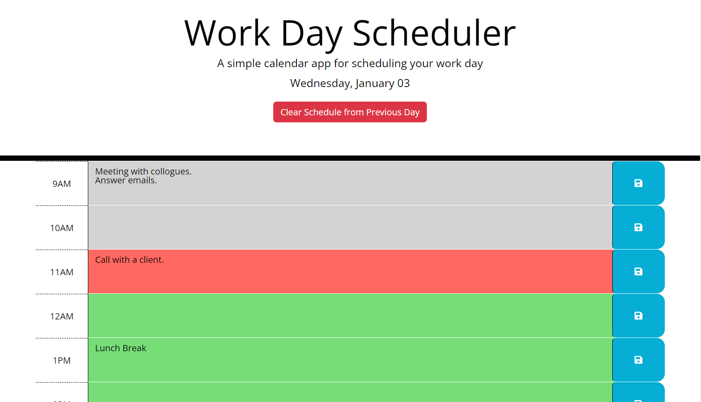
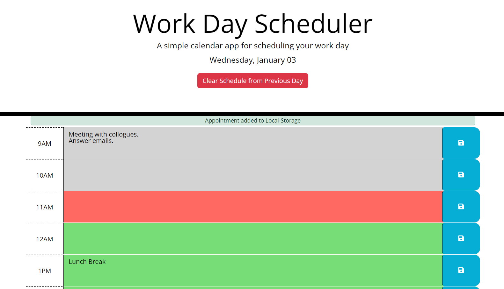

# <Work-Day-Scheduler>

## Description

This project allows users to input important events and tasks in a daily planner, enabling efficient time management. It can serve as a to-do list for organizing activities during work hours, spanning from 9 AM to 5 PM.

## Usage

To begin, click on an empty area next to the designated time to enter tasks and events. Ensure to save your entries by clicking the save icon next to the relevant box to avoid potential loss. A small green pop-up will appear at the top, confirming the successful save. Each time block is color-coded for easy identification. The current time is highlighted in red, helping users focus on present tasks, while future hours are displayed in green, and past hours in grey.

Below is an example image of the usage of the Work Day Scheduler:

This image displaying the saved pop up on top:

## Credits

Some code was adapted from [Stack Overflow](https://stackoverflow.com/questions/5946278/javascript-extracting-the-digits-from-different-positions-from-a-string) to understand how to extract digits from a string. The concept of `closest` in jQuery was read and implemented from [W3Schools](https://www.w3schools.com/jquery/traversing_closest.asp#:~:text=The%20closest()%20method%20returns,first%20ancestor%20of%20DOM%20elements.).

## Deployment

The deployed website is available at:

[Work Day Scheduler](https://cemileblks.github.io/work-day-scheduler/)

## License

This project is licensed under the MIT License. Please refer to the LICENSE in the repo.